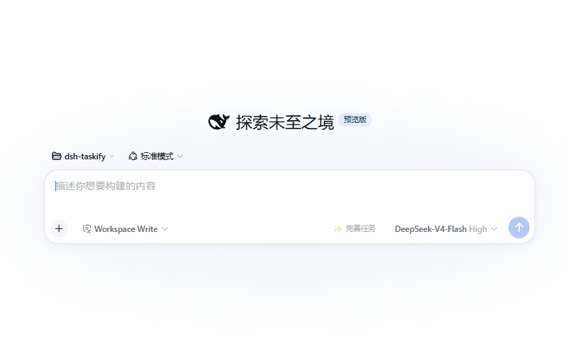

# DSH Taskify

**简体中文（默认）** | [English](./README_EN.md)

> **Coding Agent 越强，越容易顺手做太多。Taskify 让它持续记住“这次只做什么”和“什么不能动”。**

Taskify 不改写 composer 里的原始 Prompt。它用 **🎯 Focus** 固定当前任务的执行范围，用 **🔒 Persistent Anchors（持久锚点）** 保留用户明确说过的硬约束，并让这些边界在当前 Session 中跨轮持续。



演示输入：

> 把 dashboard 卡片布局改得更紧凑、整齐一点，后端别动，不要新增依赖，也别顺手改其他功能。

```text
🎯 Focus
调整 dashboard 卡片布局，使其更紧凑、整齐

🔒 Anchors
不修改后端
不新增依赖
不处理其他功能
```

**原始 Prompt 保持不变。**

[](https://github.com/deepseek-ai/deepseek-harness)
[](https://github.com/GearVoid/dsh-taskify/releases/latest)
[](./LICENSE)


## 两个东西：Focus + Anchors

### 🎯 Focus

回答：**“这次最多做到哪里？”**

一个 Session 最多一个 Focus。它可以由用户手写，也可以来自 AI suggestion。Suggestion 只是可编辑、可忽略的草稿，必须由用户确认后才会成为权威 Focus，绝不会自动生效。

### 🔒 Persistent Anchors

回答：**“哪些东西不能变？”**

Anchors 从当前 Prompt 中提取用户明确说出的硬约束。每个 Anchor 必须带有来自原文的 exact evidence；一个 Session 可以有多个 Anchors。

## 安装或更新

```sh
dsh plugin --profile web add github:GearVoid/dsh-taskify#v0.4.0
dsh web
```

如果已经安装旧版本，重新执行 `plugin add` 并重启 DSH Web，以加载新的 Host 代码和 Client bundle。

## 它怎么工作

```text
写原始任务
   ↓
点击 ✨ Taskify
   ↓
AI 建议 Focus + 提取 Anchors
   ↓
用户确认 / 编辑 / 忽略 Focus
   ↓
发送原始 Prompt
   ↓
Focus + active Anchors 持续进入后续轮次
```

- Taskify 不修改 composer 中的原始文本，也不替用户自动发送。
- Focus suggestion 不自动生效；只有用户确认后才会成为当前 Session 的 Focus。
- Anchors 只来自用户在当前 Prompt 中明确说过的硬约束。
- 激活后，Focus 与 Anchors 会持续指导后续轮次，无需反复重写这些边界。

用户可以 Set、Edit、Pause、Resume 或 Clear Focus；也可以 Pause、Resume、Remove 单个 Anchor，或 Clear All。

## 为什么会需要这个

- 长任务中，开头写下的边界很容易随着轮次增加而漂移。
- Coding Agent 往往会顺手重构、补抽象、加 fallback，或把修改扩展到邻近功能。
- 更强的 Agent 通常更主动，但“能做更多”不等于“用户授权它做更多”。
- Taskify 的目标不是让模型变笨，而是持续保留用户确认的执行边界。

**Extract, don’t invent.** Anchors 只提取明确约束，不把偏好升级成硬规则，也不凭空补充路径、依赖或 API。

**Persistence ≠ Enforcement.** Focus 与 Anchors 是持续的 model guidance，不是 sandbox、policy engine 或机械拦截层。

## Focus 与 Persistent Anchors

| | 🎯 Focus | 🔒 Persistent Anchors |
|---|---|---|
| 回答的问题 | 这次最多做到哪里 | 哪些东西不能变 |
| 数量 | 每 Session 最多一个 | 每 Session 可多个 |
| 来源 | 用户手写或确认 AI 建议 | 当前 Prompt 的明确硬约束 |
| 生命周期 | Set / Edit / Pause / Resume / Clear | Pause / Resume / Remove / Clear All |

## 提取与可信边界

```json
{
  "anchors": [
    {
      "text": "不修改后端",
      "evidence": "后端别动"
    }
  ]
}
```

每个 Anchor 都必须能追溯到当前草稿中的精确 evidence。`尽量简单`、`最好别碰后端` 等偏好或弱化表达不会被升级成硬约束；`anchors: []` 是合法成功结果。

- **Literal Lock**：保护代码块、行内代码、路径、URL、IP/端口、版本、CLI 和常见标识符。
- **Provenance**：evidence 必须是当前草稿的精确子串。
- **Concrete Claim Guard**：Anchor 不能凭空加入新路径、URL、CLI、版本或明显代码标识符。

Taskify 不搜索工作区，不生成目标、计划、验收标准或工程建议，也不重新实现 DSH `/goal`。

## 状态与持久化边界

- **Host authoritative state**：Client 只是可丢弃的快照缓存；刷新、重挂载和事件重放后以 Host 为准。
- **Revision / CAS**：Host 拒绝过期写入；冲突后 Client 重新读取权威快照。
- **Draft invalidation**：修改尚未发送的草稿只会使 pending/armed request 失效，不会删除 active Focus 或 Anchors。
- **Durable replay**：当 DSH persistence provider 确认 flush 时，状态可通过已知事件重放恢复；失败或不可确认时会明确降级。
- **Runtime guidance**：后续轮次通过 DSH 官方 `systemPrompt.context` 获得 active Focus 与 active Anchors；paused 项不会进入上下文。
- **Session isolation**：状态按精确 session id 隔离，新 Session 和 fork 默认不继承 Focus 或 Anchors。

## 当前不做什么

Taskify 是持续的 model guidance，不是 mechanical enforcement。当前不包含：

- 文件写入拦截；
- 依赖安装拦截；
- 自动 rollback；
- Git baseline；
- semantic diff audit；
- native `/goal` replacement；
- watchState、polling 或 WebSocket；
- 多 Client 实时同步；
- 自动任务完成判断。

## 兼容性

- DeepSeek Harness 启动器：`0.1.1-rc.2`
- DSH 核心插件 API：`0.1.0-rc.6`
- DSH Web Client API：`0.0.1-rc.1`
- Node.js：`^22.19.0 || >=24.0.0`
- pnpm：`11.x`（本仓库使用 `11.19.0`）

DSH 仍处于 Developer Preview，未来版本可能带来兼容性变化。

## 开发与测试

```sh
pnpm install --frozen-lockfile
pnpm test
pnpm build
pnpm pack:check
```

当前测试覆盖 Focus suggestion 与生命周期、Anchor 提取及去重、Literal preservation、Provenance、草稿竞态、Host revision、durable replay、Session 隔离、联合 runtime context，以及 turn-settled Client convergence。

## 项目结构

```text
src/host/       Host 权威状态、激活绑定、持久化与 runtime context
src/client/     Taskify 按钮、Focus/Anchor Dock 与 Client 快照收敛
src/shared/     Compiler、Schema、Projection、Session Runner
scripts/        Client bundle 构建脚本
test/           Node.js 测试
client.js       构建生成的浏览器端 bundle（请勿手工编辑）
cordis.patch.yml
```

更详细的历史设计记录见 [`docs/`](./docs/)。

## 许可证

[MIT](./LICENSE)
